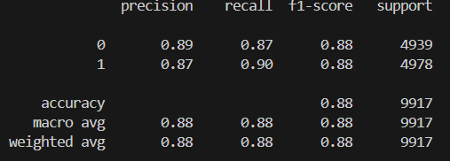

# 🎭 IMDB Sentiment Analysis App (Machine Learning)

A Machine Learning–based **Sentiment Analysis Web App** that classifies movie reviews as **Positive** or **Negative** using **TF-IDF** and **Logistic Regression**, and is deployed using **Streamlit**.

---

## 📌 Project Overview

Sentiment analysis is a core Natural Language Processing (NLP) task used to understand opinions and emotions from text.  
This project demonstrates a **complete ML pipeline** — from text preprocessing and model training to deployment as an interactive web application.

---

## 🚀 Features

- Clean and preprocess raw text reviews
- Convert text to numerical features using **TF-IDF**
- Train a **Logistic Regression** classifier
- Evaluate model using standard metrics
- Interactive **Streamlit web app** for real-time predictions
- Confidence score for each prediction

---

## 🧠 Machine Learning Approach

- **Text Preprocessing**
  - Lowercasing
  - Removing punctuation and URLs
  - Stopword removal
  - Lemmatization

- **Feature Engineering**
  - TF-IDF Vectorization (max 5000 features)

- **Model**
  - Logistic Regression (Linear Classifier)

---

## 📊 Dataset

- **IMDb Movie Reviews Dataset**
- Binary sentiment labels: `positive`, `negative`

Dataset structure:
IMDB_Sentiment_Analysis_ML/
- ├── app.py # Streamlit app
- ├── model.pkl # Trained ML model
- ├── tfidf.pkl # TF-IDF vectorizer

- ├── notebook/
- │     └── eda.ipynb
- ├── data/
- │     └── raw/
- │         └── imdb_reviews.csv
- │     └── processed/
- │         └── IMDB_Dataset_cleaned.csv
- ├── data/
- |     └── preprocess.py # For preprocessing dataset
- │     └── model.py # For Model training & evaluation
- |     └── Predict.py # For Prediction Logic


---

## ⚙️ Installation & Setup

### Clone the Repository
```bash
git clone https://github.com/Shreyak1999/IMDB_Sentiment_Analysis_ML.git
cd IMDB_Sentiment_Analysis_ML
```
### Install Requirements
```bash
pip install -r requirements.txt
```

### Train the Model

Run the training script from the project root:
```bash
python src/train.py 
```
## 🌐 Run the Web App
```bash
streamlit run app.py
```

## 📈 Model Performance




## 📜 License

### **This project is open-source and available for learning and experimentation.**

## 👤 Author
```bash
Shreyak Shailendra
Machine Learning | NLP | Applied Policy & Data Analysis
```